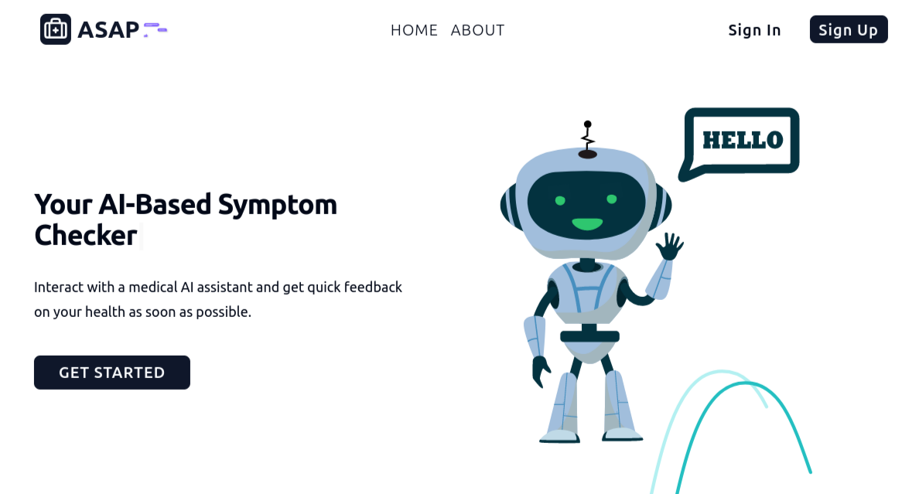

 

  Like this project ? Leave us a star ⭐

 

  <a href="#" target="_blank">
  <picture>
    <source media="(prefers-color-scheme: dark)" srcset="assets/asap.png">
    
  </picture>
  </a>

<h3 align="center">
  Your AI-Based Symptom Checker 🔥.
</h3>

 

  
  
  
  

ASAP is an AI-based symptom checker designed to provide accurate and timely diagnoses based on the symptoms entered by users. ASAP cross-references inputted symptoms with an extensive medical database, and delivers a probable diagnosis. ASAP aims to empower users with valuable health insights, enabling them to make informed decisions about their well-being and to seek appropriate medical attention when neccessary.

---

  

 

## How It Works

ASAP integrates with Google Gemini API as the LLM of choice for interacting, processing and analyzing user input, which can either be by text or a voice recording.This analysis is against a medical knowledge base, ensuring that it provides a high level of accuracy and efficiency in interpreting user symptoms.It uses a question generation paradigm to clarify ambiguous symptoms and to help narrow down the potential diagnosis.

## For whom ?

ASAP is designed to help individuals experiencing symptoms, who want to understand potential health issues before consulting a healthcare professional.

## Guide

> [!WARNING]
>
> ASAP is in **ALPHA**, and is to be considered unstable.
>
> We are working fulltime on a stable release.

Please refer to the [contributing guide](CONTRIBUTING.md) for how to contribute to ASAP.

## License

Copyright 2024 ASAP

Licensed under the AGPL V3 License.   See [LICENSE.md](LICENSE.md) for more information.

## Contributors ✨

## Star History

Truly grateful for your support 💖

